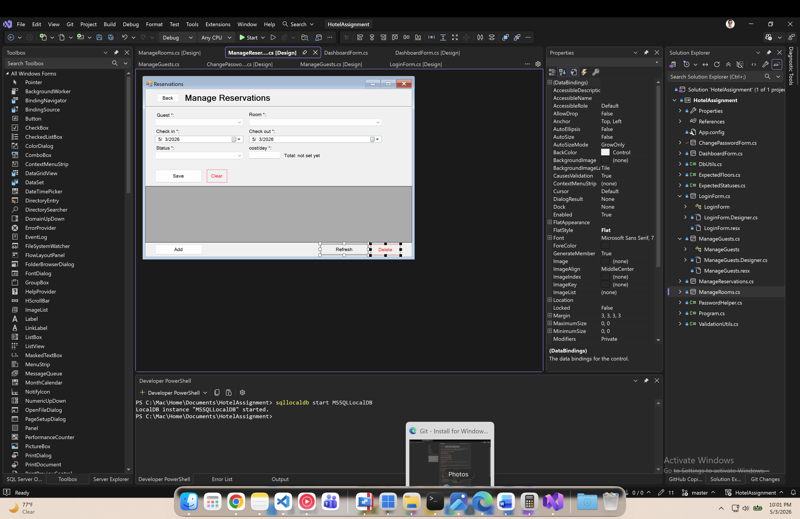
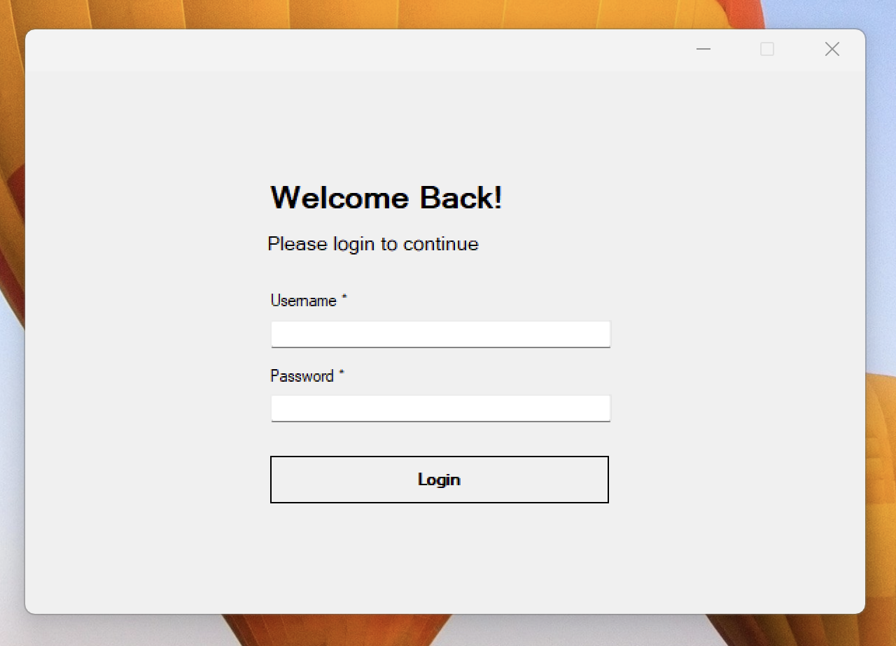
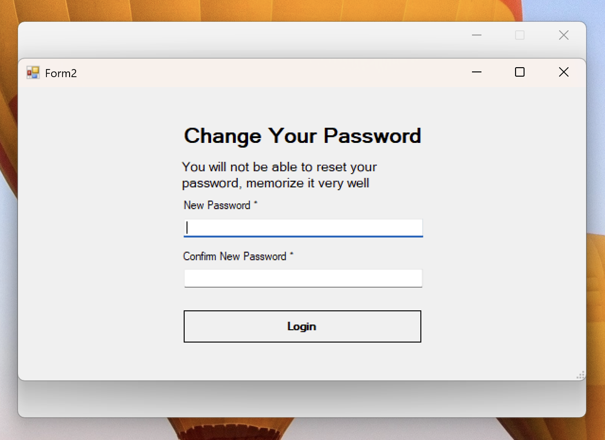
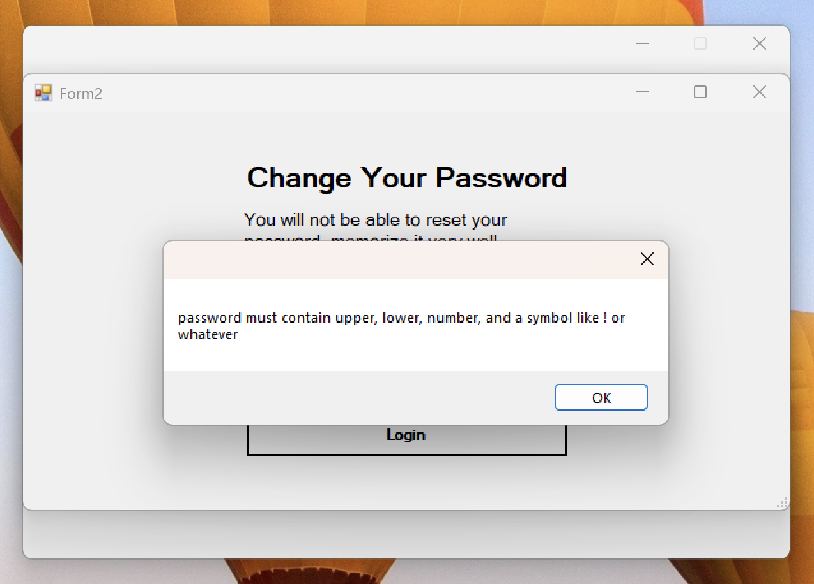
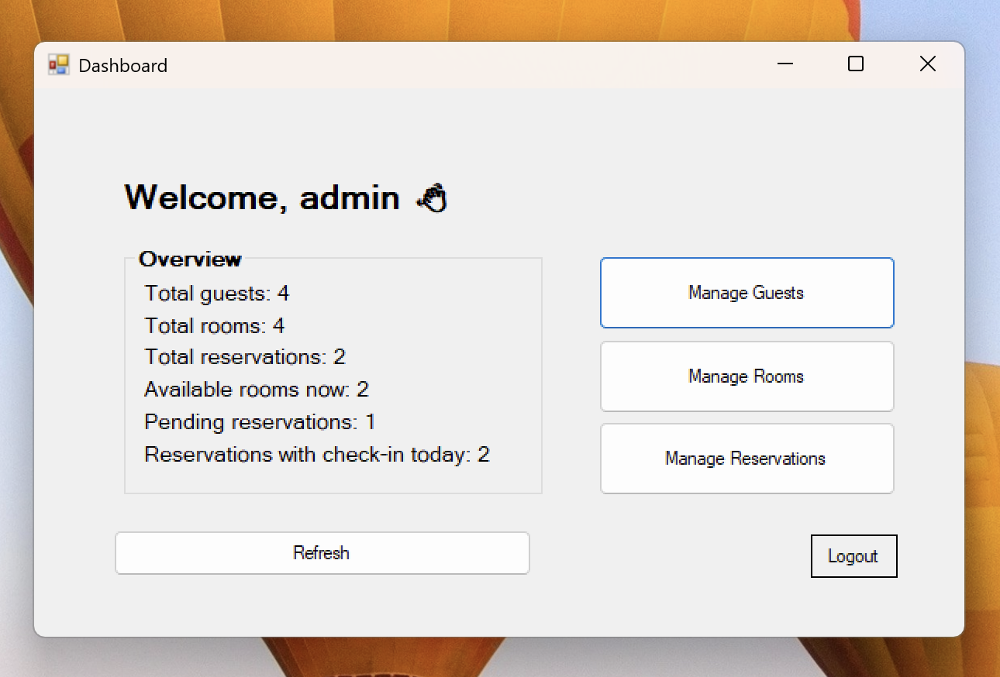
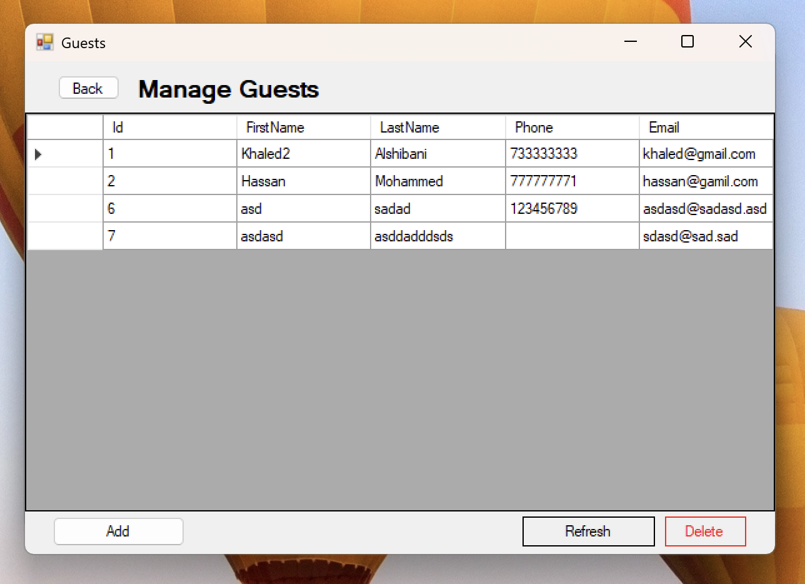
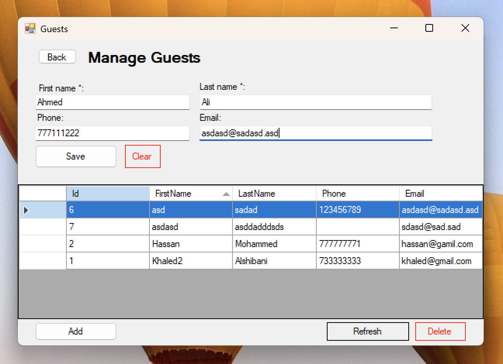
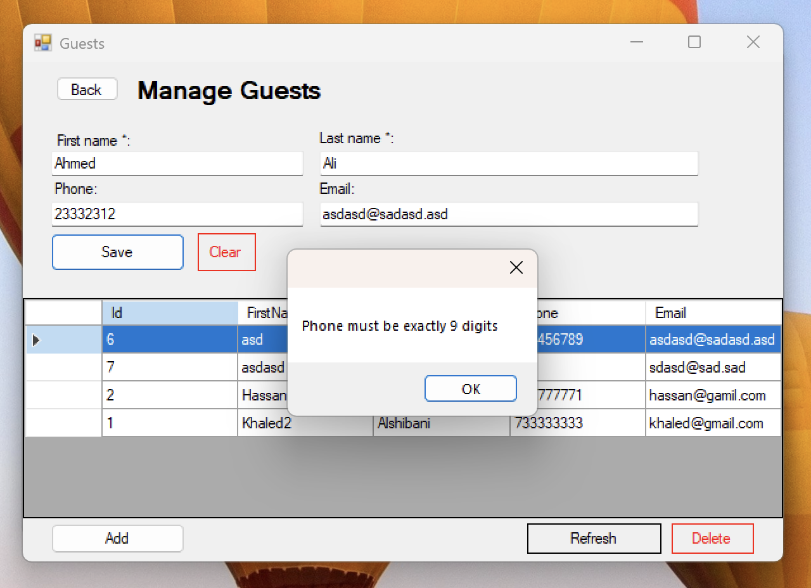
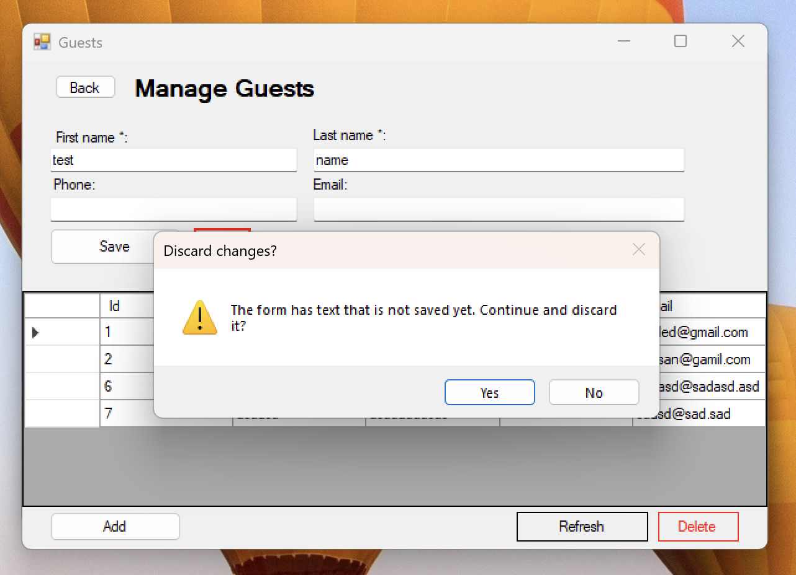
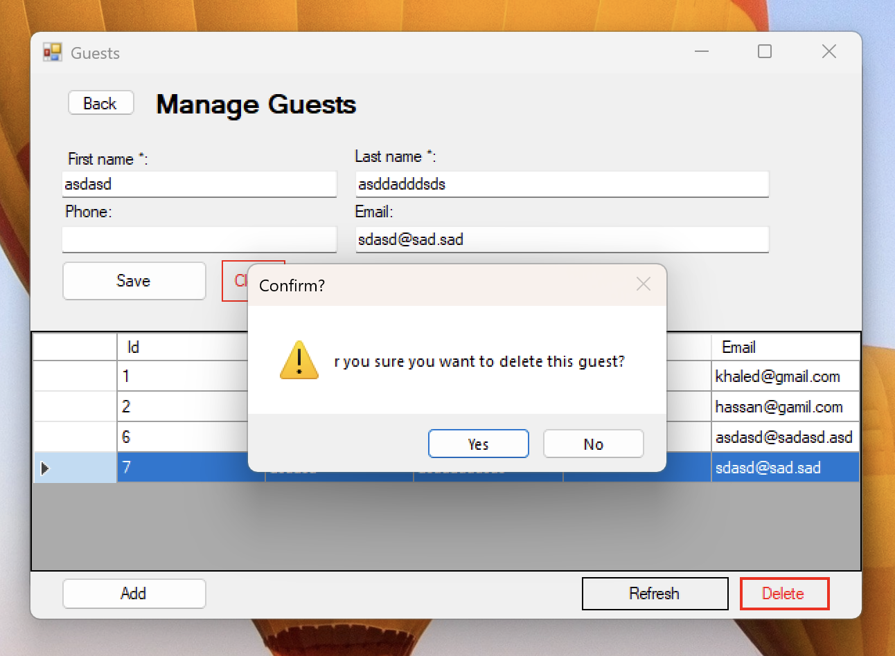

# WinForms assignment

This is an assignment windows forms app.

development was on Windows in Parallels on Mac

and that's why the connection string may be looks weird. I followed [https://kb.parallels.com/en/129699](https://kb.parallels.com/en/129699)

## Screenshots

Login:

Change password (first login):

Password rules message:

Dashboard after login:

Manage guests:

Edit guest:

Phone validation:

Clear/discard confirm:

Delete guest confirm:

